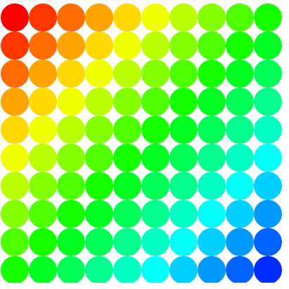
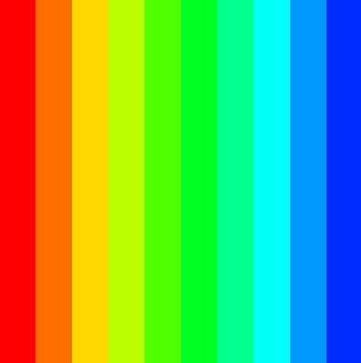
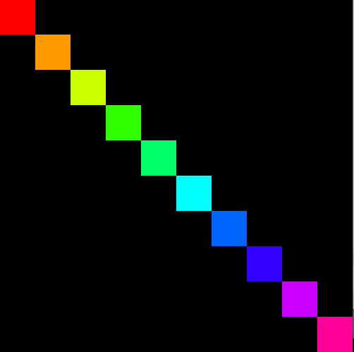
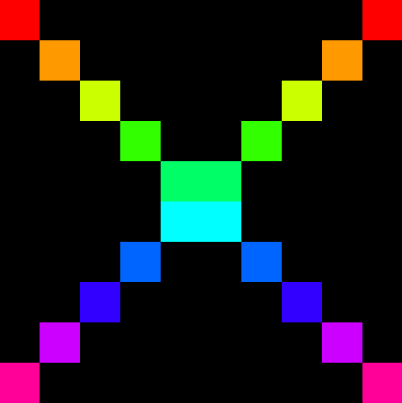
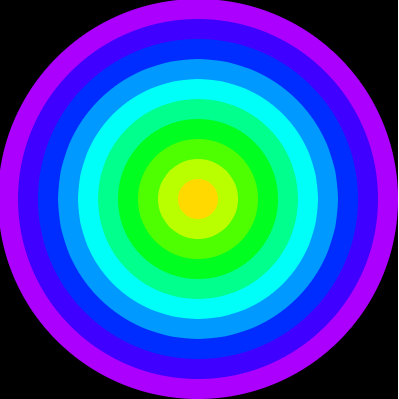
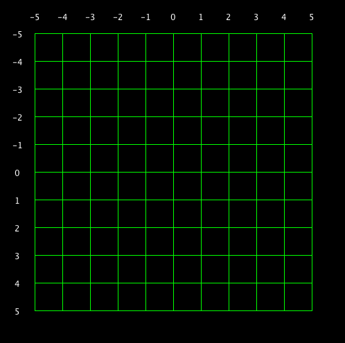
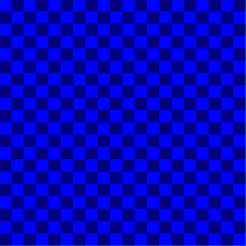
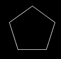
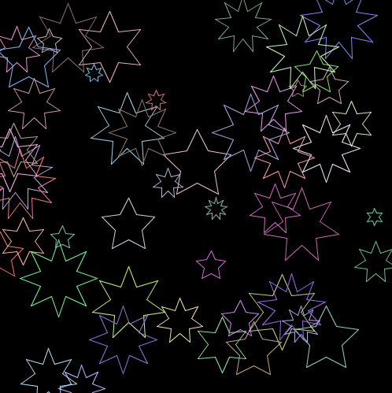

# Creative Coding for AI & Data Science 2026

```
Greetings fellow octopus
```

# Hello from Rishi

# Assessment
- End of year programming test 33%
- Weekly engagement mark 33%
- [Assignment 1 33% - Due 30/04/2026](assignment.md)

# Notes
- [Godot 2D & 3D Essentials](notes/godot%20intro.pdf)
- [GDScript Comprehensive](notes/gdscript.pdf)

# Resources
- [FOSSIKAL](https://github.com/skooter500/csresources/blob/main/foss_resources.md)
- [CSResources git repo](https://github.com/skooter500/csresources/blob/main/git_ref.pdf). Here you will find links to the previous courses and all my quick references
- [Git for poets](https://www.youtube.com/watch?v=BCQHnlnPusY)
- [Godot for beginners](https://www.youtube.com/watch?v=LOhfqjmasi0)
- [GDScript Tutorial](https://www.youtube.com/watch?v=e1zJS31tr88)
- [5 Games Made in Godot to inspire you each week](https://www.youtube.com/@stayathomedev) 


## Week 9

## Lab - Use git from the shell

### Part 1

- Create a NEW git repo with a NEW Godot project in it. 
- Put it on github
- Make edits to the local files
- Commit and push them
- Add files to the project and commit the changes 
- Create a new branch
- Make changes on the branch and commit
- Merge the branch with main
- Push to github

### Part 2

- Star THIS repo
- Fork THIS repo
- Clone the forknew
- Configure the remotes 
- Create a new branch
- Make some changes
- Commit
- Merge with main
- Push

You can focus on creating a repository for your assignment

THis is what your assignment [README.MD](https://github.com/skooter500/csresources/blob/main/assignment/README.md) file should look like

Submit the urls to repositories you create today on Brightspace.

If you misssed last weeks class do this:

- Read the first 3 chapters of the [git manual](https://git-scm.com/docs/user-manual.html) - Up as far as Exploring git history is enough. 
- Use the [git reference](https://github.com/skooter500/csresources/blob/main/git_ref.pdf)
- Try this [step-by-step lab](https://github.com/skooter500/csresources/blob/main/gitlab.md). It is for Java, but you can adapt it. 
- Install git for Windows on your laptop. Mac users, it's alreading installed. Use from terminal.


## Week 8

## Lab - Random Walk

- Open Scene week7_a - This is the code we wrote on Friday, but I've modified it a bit 
- Modify the program so that instead of taking input from the mouse to decide what notes to play, you pick a random cell, play that sequencea and after one second, you choose one of the 8 surrounding cells to move to next. Repeat this process to generate a random walk melody through the grid. If you get to the edges, wrap around.
- Upload your script to Brightspace to get your mark for this week

Bonus! 

- Investigate Seamus Tansey and listen to some of his music 
- Experiment with different instruments. See [list of midi instruments](https://soundprogramming.net/file-formats/general-midi-instrument-list/).
- And effects on the master audio bus to get different sounds
- Have a slider to adjust the root note (the note the grid starts on)  
- Have a slider to adjust the playback speed
- Have the cell thats playing "light up" when it gets played 


## Week 7

## Lab
- Open week7 scene and see how it works. Look at the script week_7.gd

The code uses MIDI to play notes through a soundfont player. Key things to know:
- Notes are numbers 0-127 (middle C is 60)
- Channel 9 is always drums
- Channels 0-8 are melodic instruments
- `play_note(note, duration, channel)` plays a note

---

## Exercise 1 – Make a Scale

Write a loop that plays all the notes from 60 to 72 (that's one octave of C major), each for 0.3 seconds on channel 0.

Then reverse it — make it go back down from 72 to 60.

---

## Exercise 2 – Change the Speed

Wrap the scale loop it in another loop that runs 4 times. Each time through the outer loop, make the notes play slightly faster. Start at 0.5 seconds and reduce by 0.1 each time.

What happens at 0.0 seconds?

---

## Exercise 3 – Drum Pattern

The `drum_loop()` function picks random drum notes between 36 and 60. Change it so instead of random notes, it plays a repeating pattern you design yourself — something like kick, snare, kick, snare.

Common drum MIDI notes:
- 36 = Bass drum
- 38 = Snare
- 42 = Closed hi-hat
- 46 = Open hi-hat
- 49 = Crash cymbal

Use a list and a loop to cycle through your pattern.

---

## Exercise 4 – Two Channels at Once

Call `drum_loop()` and also write a new function called `melody_loop()` that plays a repeating melodic pattern on channel 0. Call both from `_ready()`.

You'll need to use `change_instrument(0, X)` to pick a sound — try instrument 30 (electric guitar) or 40 (violin). A list of General MIDI instruments is easy to find online.

---

## Exercise 5 – Build a Song

Design a function called `play_song()` that plays at least three different sections — for example a verse, a chorus, and a repeat of the verse. Each section should be its own loop. Use `change_instrument` to switch sounds between sections.

There's no right answer — experiment and see what sounds good.

---

## Exercise 6 – The Slider Controls the Loop

Currently the slider controls which note plays when you press the button. Modify the code so the slider controls the **tempo** of the drum loop instead — i.e. the duration between notes.

You'll need to store the tempo in a variable that your loop reads each time around

Bonus idea!!!!
Draw a 2D grid on the screen 12 x 12. make the cells different colors using HSV. As you move the mouse around, it plays a different note. Have it go up 12 notes every row and up and  down a single note every column 


- Make a final audio recording and upload the file to Brightspace. Also a zip of your project


## Week 6
## Lecture - Using MIDI

## Lab - Flower Jam
Your task today is to go outdoors for a nice walk, in groups of two or three, and take photos of different flowers, plants and trees on the campus with your phones. Spend around half an hour doing this. Get a good variety.

When you come back to the lab, create a "Flower Generator" algorithm that generates the patterns, shapes and colors of the pictures you took. Use the drawing functions and loops. Use the spiral example we made on Friday as help. Study this first to understand it!! You can also experiment with recursion to create trees if you feel inspired. Here is [an article on the subject](https://natureofcode.com/fractals/).

I encourage you NOT to use AI for this task and instead to contemplate the task and experiment with your code to make it work. Remember, You are creating art with code and expressing YOIURSELF. 

Upload to brightspace at least:

- 1 photo (multiple preferred)
- 1 screenshot of your flower generator (multiple preferred!)
- Your code

- [Previous examples](https://photos.app.goo.gl/TxMtsRRuDrQBonb56)


## Week 5 
## Lecture
- Triangles, Spirals & loops


## Lab - Create a Simple Game

Its [Godó Gaedhleach tonight](https://www.eventbrite.ie/e/1982738409958?aff=oddtdtcreator) Fáilte!

The [Godot XR Jam](https://itch.io/jam/godot-xr-game-jam-mar-2026) is coming up in March.

For today:

Create BugZap. Create the main game and scoring first. Add start and game over scene if you have time:

[](https://www.youtube.com/watch?v=s6PA8jtWneQ)

- Start with creating the player
- Moving the player with input
- Creating the bug
- Shooting

Bonus!

- Improve the bug movemenmt with Tweens
- Add more bugs
- Create a Particle system for the explosion 
- Explore the history of the original game

## Week 4 Lab - Creating Interactive Systems

- Download this repo to get the examples!

For this lab you will be creating three interactive systems. They start simple and get harder. See how far you can get and upload screenshots to Brightspace to get your mark for this week

### PhysicsPaint
Create a new scene and add a 2D Node as the root. Save the scene as PhysicsPaint. Add a script to the root. You can detect mouse movement by adding the following code:

```GDScript
func _input(event: InputEvent) -> void:	
	if event is InputEventMouseMotion:
		print(event.position.x)
		print(event.position.y)
```

- Add code so that colorful Boxes fall whenever the mouse moves over the viewport.
- Add sliders to the user interface to control the Hue, Saturation Brightness and Alpha of the generated Boxes so that their colors are not random.
- Add a Timer node on the Boxes so that they get deleted after 5 seconds so that the scene does not fill up 
- Experiment with changing the gravity settings!

### Theramin

Here are some videos for inspiration for this second part:

- https://www.youtube.com/watch?v=aJBDHxyLEHg

- https://www.youtube.com/watch?v=w5qf9O6c20o

- https://www.youtube.com/shorts/UcqyyAXy43w

Here is some code for a sine wave oscillator:

```GDScript
extends Node

# Sine Wave AudioStreamGenerator
# Attach to a Node, add an AudioStreamPlayer child named "AudioStreamPlayer"

@export var frequency: float = 440.0   # Hz (A4)
@export var amplitude: float = 0.5     # 0.0 - 1.0
@export var sample_rate: float = 44100.0

var playback: AudioStreamGeneratorPlayback
var phase: float = 0.0

func _ready() -> void:
	var stream := AudioStreamGenerator.new()
	stream.mix_rate = sample_rate
	stream.buffer_length = 0.1  # 100ms buffer

	$AudioStreamPlayer.stream = stream
	$AudioStreamPlayer.play()
	playback = $AudioStreamPlayer.get_stream_playback()


func _process(_delta: float) -> void:
	_fill_buffer()


func _fill_buffer() -> void:
	var frames_available := playback.get_frames_available()
	var phase_increment := TAU * frequency / sample_rate

	for i in frames_available:
		var sample := amplitude * sin(phase)
		playback.push_frame(Vector2(sample, sample))  # stereo (L, R)
		phase = fmod(phase + phase_increment, TAU)


# Call these at runtime to change the tone
func set_frequency(hz: float) -> void:
	frequency = hz

func set_amplitude(amp: float) -> void:
	amplitude = clamp(amp, 0.0, 1.0)
```

- Add this to a new scene. Use the mouse Y to control the frequency and the mouse X to control the amplitude. 
- Use a nested for loop to draw this:



- Have the parameters of the image change with the mouse - for example mouse changes the colors or sizes or numbers of circles
- Experiment with this line of code to generate different sounds. Add in additional Sin Waves to generate harmonics:

```GDScript
var sample := amplitude * sin(phase)
```

### Spiral Jam
Create this Spiral Generator:

- https://youtu.be/aZTHZGjHZzM

Take screenshots and videos of your creations and upload to Brightspace

## Week 3
- Scripting with GDScript
- Nodes for 2D
- RigidBodies
- Setting colors in code
- Spawning scenes from other scenes

### Lab - Drawing with Code

### Learning Outcomes
- Godot workflows
- Creatinve problem solving and analysis
- Creating a visual system from code
- Undetstanding the relationship between color and shapes and code
- For loop
- if statement
- Computational thinking

Use the functions in _draw() to create the following patterns:



















Try these if statement exercises:

[](https://www.youtube.com/watch?v=18kMOeygmHA)

Import some sprites and get them moving around!

Check out any of the Godot projects on [my github repo](http://github.com/skooter500) for ideas.

Take screenshots of whatever you create today and upload [this form](https://forms.office.com/Pages/ResponsePage.aspx?id=yxdjdkjpX06M7Nq8ji_V2ou3qmFXqEdGlmiD1Myl3gNURUwwN04xREJaSENNSlNDU1g2RDAyV09LUS4u)

- [Learn how to use bash and git](https://github.com/skooter500/csresources/blob/main/gitlab.md)


## Week 2 - Intro to Godot
- Godot 2D and 3D examples
- Godot 2D nodes
- Movement and rotation
- 2D Drawing primitives
- 2D Colors
- Using variables
- [Playlists of previous Godot projects](https://www.youtube.com/@skooter500/playlists)


We made a little interactive art think where you move the mouse. Open the project in Godot!

my change for project
